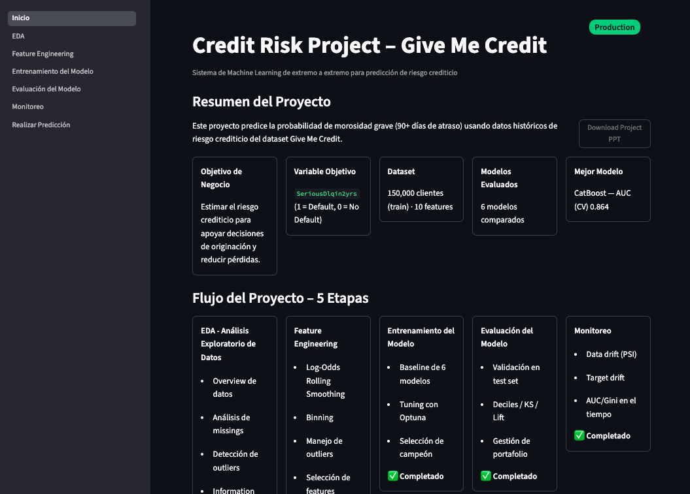

# Give Me Some Credit — Riesgo Crediticio


## Presentación

📊 [**Descargar presentación ejecutiva (.pptx)**](presentacion/Resumen_Presentacion.pptx)

Resumen ejecutivo del proyecto en formato PowerPoint: contexto de negocio, resultados técnicos del modelo y economía de cartera por banda de riesgo.

## Descripción del problema

Este proyecto resuelve el desafío de Kaggle **"Give Me Some Credit"**: un problema de clasificación binaria que busca predecir si un cliente incurrirá en morosidad grave dentro de los próximos dos años (`SeriousDlqin2yrs`), a partir de variables financieras como nivel de endeudamiento, ingresos, líneas de crédito abiertas y morosidades pasadas.

El proyecto cubre el pipeline de riesgo crediticio de punta a punta, no solo el modelo:

1. **Análisis exploratorio (EDA)** — overview de los datos, missings, outliers, distribuciones, Information Value y PSI (drift train vs. test).
2. **Feature Engineering** — encoding WOE, binning, tratamiento de outliers y selección de features por correlación/VIF/IV/PSI/Gini.
3. **Entrenamiento del modelo** — baseline de varios algoritmos (Regresión Logística, Árbol de Decisión, Random Forest, XGBoost, LightGBM, CatBoost) y tuning de hiperparámetros con Optuna.
4. **Evaluación del modelo** — métricas de performance (AUC, KS, Gini), tablas de deciles ponderadas por saldo y simulación de gestión de portafolio (pricing, ROA por banda de riesgo).
5. **Monitoreo** — comparación de performance, PSI, IV y variación de contribución SHAP entre un periodo baseline y periodos actuales.

El modelo final queda desplegado detrás de una **API en FastAPI** que calcula la probabilidad de default (PD) y clasifica al cliente en una banda de riesgo, y se consume desde un **dashboard en Streamlit** que recorre todo el pipeline de forma interactiva.

## Vista del dashboard



## Arquitectura

El proyecto está organizado en dos capas: el **pipeline de modelado** (notebooks) y la **capa de despliegue** (backend + frontend), que consume los artefactos que el pipeline produce.
La parte del frontend se elaboró mediante Claude Code usando la metodología SPEC Driven Design, pueden verlos en la carpeta specs.

```
notebooks/01_eda.ipynb
        │  EDA: overview, missings, outliers, IV, PSI
        ▼
notebooks/02_feature_engineering.ipynb
        │  WOE, binning, selección de features
        │  → artifacts/feature_engineering/preprocessing.pkl
        ▼
notebooks/03_training_model.ipynb
        │  Baseline de modelos + tuning con Optuna
        │  → pipeline_htunning_catboost.pkl / pipeline_htunning_lgbm.pkl
        ▼
notebooks/04_model_evaluation.ipynb
        │  AUC, KS, deciles, gestión de portafolio (ROA por banda)
        ▼
notebooks/05_monitoring.ipynb
        │  Performance, PSI, IV y SHAP entre baseline y periodo actual
        ▼
┌─────────────────────────┐        ┌──────────────────────────┐
│  backend/  (FastAPI)     │◀──────▶│  frontend/  (Streamlit)  │
│  POST /api/v1/predict    │  HTTP  │  Dashboard multipágina    │
│  Calcula PD y banda      │        │  del pipeline completo    │
└─────────────────────────┘        └──────────────────────────┘
```

## Estructura de carpetas

```
2-give-me-some-credit/
├── notebooks/          # Pipeline: 01_eda .. 05_monitoring
├── data/                # raw / external / interim / processed
├── artifacts/           # Salidas de cada etapa (tablas, figuras, modelos)
├── backend/             # API FastAPI (predicción de riesgo crediticio)
├── frontend/            # Dashboard Streamlit
├── presentacion/        # Presentación ejecutiva (.pptx)
├── design/              # Capturas y referencias visuales
├── specs/               # Specs del flujo spec-driven
├── params.yaml
└── setup.py
```

## Instalación y uso rápido

**Backend (FastAPI):**

```bash
cd backend
pip install -r requirements.txt
uvicorn src.main:app --host 0.0.0.0 --port 8082
```

La API queda disponible en `http://localhost:8082`, con documentación interactiva en `/docs`.

**Frontend (Streamlit):**

```bash
cd frontend
pip install -r requirements.txt
streamlit run src/app.py
```

## Stack tecnológico

- **Modelado:** scikit-learn, XGBoost, LightGBM, CatBoost, Optuna, SHAP
- **API:** FastAPI, Pydantic, Uvicorn, Docker
- **Dashboard:** Streamlit, Plotly
- **Datos:** pandas, numpy, pyarrow

## Estado del proyecto

- ✅ Pipeline de notebooks (EDA → Feature Engineering → Training → Evaluation) completo.
- ✅ Backend FastAPI funcional, con modelo servido y Dockerfile listo.
- 🚧 `notebooks/05_monitoring.ipynb` está casi vacío, aunque el módulo compartido de monitoreo (`Monitoring/utils/monitor.py`) ya está construido.
- 🚧 `frontend/Dockerfile` todavía vacío — el dashboard corre localmente pero aún no está containerizado.

## Licencia

Este proyecto está bajo la licencia MIT. Ver el archivo [LICENSE](LICENSE) para más detalles.
